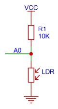
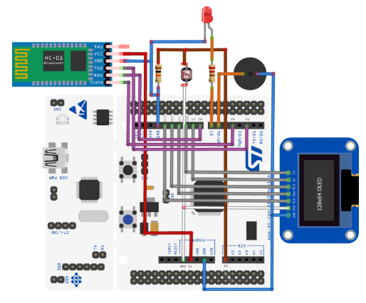
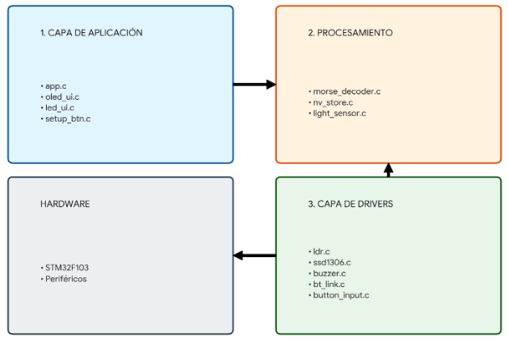
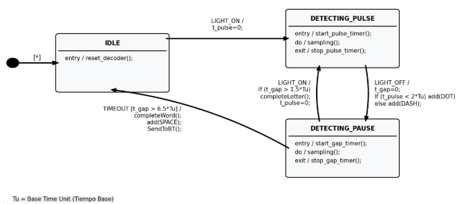
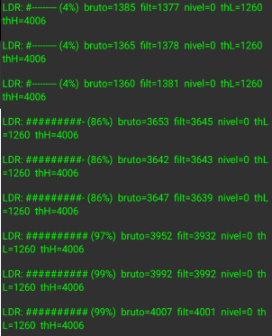
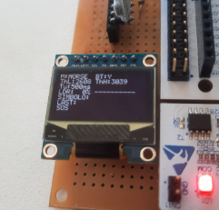
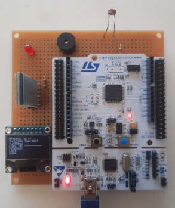
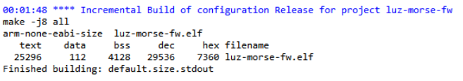
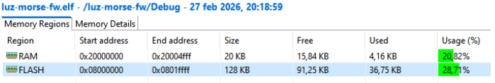

<div align="center">


**UNIVERSIDAD DE BUENOS AIRES**  
**Facultad de Ingeniería**  
**86.65 – Sistemas Embebidos (TA134)**  
**Grupo 4**

# Memoria del Trabajo Final
## Luz-Morse: Decodificador de Código Morse por Señales de Luz

**Autores**  
Camila Sol Monforte — Legajo 107.193  
Federico Spratte — Legajo 105.694  
Haidar Ali Morhell — Legajo 108.576  

**Fecha:** 06/03/26  

*Trabajo realizado en la Ciudad Autónoma de Buenos Aires, entre diciembre de 2025 y marzo de 2026.*
</div>

---

## Resumen

El presente trabajo consiste en el diseño, implementación y validación de un sistema embebido capaz de decodificar en tiempo real el código Morse transmitido a través de señales ópticas. El dispositivo, denominado Luz-Morse, utiliza un sensor de luz LDR (Light Dependent Resistor, Fotorresistencia) para capturar secuencias de pulsos lumínicos y una plataforma basada en microcontrolador para interpretar dichas señales, discriminando entre puntos, rayas y pausas. La información decodificada se traduce a caracteres alfanuméricos que son enviados inalámbricamente vía Bluetooth a una aplicación móvil para su visualización por parte del usuario.

Este proyecto aborda desafíos técnicos significativos como el acondicionamiento de señales analógicas, la calibración automática ante cambios de luz ambiental y la implementación de una arquitectura de firmware bare metal orientada a eventos.

---

## Registro de versiones

*Historial de revisiones del documento.*

| Revisión | Cambios realizados | Fecha |
| :---: | --- | :---: |
| 1.0 | Consolidación del informe final (estructura completa + revisión de coherencia entre requisitos, hardware y firmware). | 20/02/2026 |
| 1.1 | Integración de figuras del informe (exportación, renombrado consistente y carga en `docs/img`). Ajuste de referencias a Figuras 3.x/4.x/6.x. | 21/02/2026 |
| 1.2 | Documentación final de arquitectura de firmware (super-loop, tareas, CLI y modos `mode light / mode ldr / mode morse`). | 22/02/2026 |
| 1.3 | Cierre de documentación del algoritmo de calibración dinámica (VL/VH/umbral) + persistencia en Flash (`nv_store.c`). | 23/02/2026 |
| 1.4 | Documentación de integración Bluetooth (HC-05 por UART) + verificación de envío de caracteres a terminal/app. | 24/02/2026 |
| 1.5 | Completar análisis de desempeño: WCET (App_Task_LightMorse = 43 µs), uso de CPU y redacción de criterios de medición. | 25/02/2026 |
| 1.6 | Completar análisis energético: mediciones por módulo (MCU, OLED, LED, buzzer, HC-05) + tabla/resumen de consumo. | 26/02/2026 |
| 1.7 | Revisión final de redacción + agregado de tabla de cumplimiento de requisitos y sección de trabajo futuro. | 05/03/2026 |

<em>Tabla 0.1 — Registro de versiones del documento.</em><br><br>

---

# Índice General

- [Introducción general](#introducción-general)
  - [1.1 Objetivo del proyecto](#11-objetivo-del-proyecto)
  - [1.2 Análisis de alternativas y selección](#12-análisis-de-alternativas-y-selección)
- [Introducción específica](#introducción-específica)
  - [2.1 Requisitos](#21-requisitos)
  - [2.2 Casos de uso](#22-casos-de-uso)
  - [2.3  Hardware utilizado](#23--hardware-utilizado)
- [Diseño e implementación](#diseño-e-implementación)
  - [3.1 Hardware del sistema](#31-hardware-del-sistema)
    - [3.1.1 Módulo de sensado y acondicionamiento](#311-módulo-de-sensado-y-acondicionamiento)
    - [3.1.2 Interfaces de salida y comunicación](#312-interfaces-de-salida-y-comunicación)
    - [3.1.3 Asignación de recursos del microcontrolador](#313-asignación-de-recursos-del-microcontrolador)
  - [3.2 Firmware del  sistema](#32-firmware-del--sistema)
    - [3.2.1 Arquitectura de software](#321-arquitectura-de-software)
    - [3.2.2 Decodificación y Máquina de Estados (FSM)](#322-decodificación-y-máquina-de-estados-fsm)
    - [3.2.3 Interfaz de Comando (CLI) y Modos de Operación](#323-interfaz-de-comando-cli-y-modos-de-operación)
    - [3.2.4 Algoritmo de Calibración Dinámica](#324-algoritmo-de-calibración-dinámica)
    - [3.2.5 Persistencia de Datos](#325-persistencia-de-datos)
- [Ensayos y resultados](#ensayos-y-resultados)
  - [4.1 Pruebas funcionales del hardware](#41-pruebas-funcionales-del-hardware)
    - [4.1.1 Respuesta del Sensor LDR](#411-respuesta-del-sensor-ldr)
    - [4.1.2 Interfaz de visualización (OLED)](#412-interfaz-de-visualización-oled)
  - [4.2 Pruebas funcionales del firmware](#42-pruebas-funcionales-del-firmware)
    - [4.2.1 Validación del Filtro Digital](#421-validación-del-filtro-digital)
    - [4.2.2 Verificación de la Calibración Dinámica](#422-verificación-de-la-calibración-dinámica)
  - [4.3 Pruebas de integración](#43-pruebas-de-integración)
  - [4.4 Análisis de desempeño](#44-análisis-de-desempeño)
    - [4.4.1 Tiempos de ejecución y uso de CPU](#441-tiempos-de-ejecución-y-uso-de-cpu)
    - [4.4.2 Consumo energético](#442-consumo-energético)
    - [4.4.3 Modo de bajo consumo](#443-modo-de-bajo-consumo)
  - [4.5 Comparación con otros sistemas similares](#45-comparación-con-otros-sistemas-similares)
  - [4.6 Documentación del desarrollo realizado](#46-documentación-del-desarrollo-realizado)
- [Cumplimiento de requisitos (versión final)](#6-cumplimiento-de-requisitos-versión-final)
- [Conclusiones](#conclusiones)
  - [7.1 Resultados obtenidos](#71-resultados-obtenidos)
  - [7.2 Próximos pasos](#72-próximos-pasos)
- [Anexo](#anexo)
- [Bibliografía](#bibliografía)

---

# Introducción general

## 1.1 Objetivo del proyecto

El objetivo principal de este trabajo es desarrollar un MPV (Minimum Viable Product, Producto Mínimo Viable) de un decodificador óptico de código Morse. Se busca que el sistema sea capaz de interpretar patrones lumínicos en tiempo real y traducirlos a texto legible, facilitando la comunicación en entornos donde el audio no es viable o se requiere una transmisión silenciosa. El alcance del proyecto abarca desde el diseño del hardware de acondicionamiento de señal hasta la programación del firmware sin el uso de un sistema operativo (bare metal).

## 1.2 Análisis de alternativas y selección

Para la realización del proyecto se evaluaron tres enfoques distintos centrados en el procesamiento de señales: un decodificador óptico, un decodificador acústico y un generador de Morse.

El decodificador acústico, basado en la captura de tonos de audio mediante micrófono, fue descartado debido a la alta complejidad que implica el filtrado de frecuencias y el procesamiento digital de señales, lo cual excede el alcance de la arquitectura de hardware propuesta. Por otro lado, el generador de Morse se consideró una opción viable pero de menor complejidad técnica en cuanto al procesamiento de entradas analógicas.

Finalmente, se seleccionó el Decodificador Óptico (Luz-Morse). Esta alternativa presenta un equilibrio óptimo entre desafío técnico y viabilidad. Permite profundizar en problemáticas esenciales de la ingeniería electrónica como la lectura de sensores analógicos (LDR), la gestión precisa de temporizadores para medir milisegundos y la implementación de lógica de control mediante máquinas de estados, utilizando hardware accesible y de bajo costo.

---

# Introducción específica

## 2.1 Requisitos

En esta sección se presentan los requisitos identificados para el desarrollo del sistema. Dichos requisitos se clasifican en diferentes grupos según su naturaleza y función dentro del proyecto. A continuación, en la Tabla 2.1, se detallan los requisitos funcionales, requisitos de hardware y requisitos de software con sus respectivas descripciones.

| Grupo | ID | Descripción |
| --- | --- | --- |
| 1. Funcionales | 1.1 | El sistema debe ser capaz de medir la duración de los pulsos de luz (estados "ON") y las pausas (estados "OFF"). |
|  | 1.2 | Debe clasificar los pulsos como “punto” o “raya” y las pausas como inter-símbolo, inter-letra o inter-palabra según los estándares del código Morse. |
|  | 1.3 | Debe traducir las secuencias de puntos y rayas válidas a su correspondiente carácter alfanumérico. |
|  | 1.4 | Los caracteres decodificados deben ser transmitidos vía Bluetooth a un dispositivo externo. |
|  | 1.5 | Debe existir un modo (SET_UP) que permita al usuario calibrar el umbral de detección de luz para adaptarse a diferentes condiciones ambientales. |
|  | 1.6 | El valor del umbral de calibración debe guardarse en memoria no volátil (Flash) para que persista entre reinicios. |
|  | 1.7 | El sistema debe proveer feedback visual (LEDs) y auditivo (Buzzer) sobre el estado de la decodificación. |
| 2. Hardware | 2.1 | Buttons: Para iniciar el modo de calibración (SET_UP) y confirmar los pasos de la misma. |
|  | 2.2 | Leds: Un led para indicar el estado de la señal (luz detectada) y otro para indicar un evento (ej. letra decodificada). |
|  | 2.3 | Buzzer: Para emitir una notificación sonora al decodificar una letra o al producirse un error. |
|  | 2.4 | Módulo HC-05 (SPP): Para la comunicación inalámbrica con una aplicación de terminal serie. |
|  | 2.5 | Flash interna: Para almacenar el umbral de luz definido durante la calibración de forma persistente. |
|  | 2.6 | Resistores: Actúan como divisores de tensión para acondicionar señales de datos y también protegen a algunos componentes frente a sobretensiones. |
|  | 2.7 | Pantalla OLED SPI: Visualización local de símbolo/letra/estado. |
|  | 2.8 | Sensor analógico: Un LDR (Light-Dependent Resistor, Resistencia dependiente de la luz) será el sensor principal para medir la intensidad de la luz. |
| 3. Software y arquitectura | 3.1 | Bare Metal: El firmware se desarrollará sin el uso de un sistema operativo. |
|  | 3.2 | Event-Triggered: La lógica principal se basará en eventos (flags temporizados y cambios de estado). |
|  | 3.3 | Estructura modular: El firmware se divide en módulos independientes: `app` (superloop y modos), entradas `button_input` (anti-rebote) y `ldr/light_sensor` (ADC, filtrado, nivel/umbrales), `morse_decoder` (ON/OFF→símbolos→caracteres según Tu), UI `led_ui`/`buzzer` (feedback no bloqueante) y `oled_ui` (estado en pantalla), comunicación `cli` + `bt_link` (comandos espejo), y persistencia `nv_store` (config en Flash) con calibración en `setup_btn`. |
|  | 3.4 | Super-Loop < 1 ms: El bucle principal estará diseñado para ser no bloqueante, con tareas periódicas de sondeo y gestión de flags. |
|  | 3.5 | Se configurará el Systick para generar una interrupción cada 1 ms, que servirá como base de tiempo para toda la lógica de temporización. |
|  | 3.6 | El decodificador se modelará con una FSM (Finite State Machine, Máquina de estados finitos) que gestionará los estados: IDLE, DETECTING_PULSE, DETECTING_PAUSE. |
|  | 3.7 | El modo SET_UP para la calibración funcionará como un menú guiado por mensajes en pantalla OLED y confirmado con un botón, utilizando los LEDs como feedback visual complementario. |
|  | 3.8 | Periféricos: SPI (OLED SSD1306) y UART (HC-05); ADC para el sensor de luz. |
|  | 3.9 | Flash interna (persistencia de thresholds y Tu). |

<em>Tabla 2.1 — Requisitos del proyecto.</em><br><br>

## 2.2 Casos de uso

En esta sección se describen los principales casos de uso asociados al funcionamiento del sistema. Cada caso de uso detalla las condiciones que lo disparan, las acciones que componen el flujo principal y los flujos alternativos que pueden surgir durante su ejecución.

### Tabla 2.2 — Caso de uso 1: Decodificar un mensaje

| Elemento | Definición |
| --- | --- |
| Disparador | El sistema detecta una transición de "oscuridad" a "luz" por encima del umbral calibrado. |
| Flujo principal | 1. El sistema inicia un temporizador para medir la duración del pulso de luz.<br>2. Al detectar el fin del pulso, clasifica su duración como "punto" o "raya".<br>3. Inicia otro temporizador para medir la duración de la pausa.<br>4. Al detectar el fin de la pausa, la clasifica y, si corresponde, finaliza una letra o palabra.<br>5. La letra decodificada se envía por Bluetooth. El led de estado parpadea y el buzzer suena.<br>6. El sistema vuelve al estado de espera (IDLE). |
| Flujos alternativos | a. Si una secuencia de pulsos no forma un carácter válido, se descarta y se notifica un error.<br>b. Si una pausa excede el tiempo de time-out, el sistema se resetea para esperar una nueva letra. |

### Tabla 2.3 — Caso de uso 2: Calibrar el sensor en un nuevo entorno

| Elemento | Definición |
| --- | --- |
| Disparador | El usuario presiona el botón "Calibrar" para entrar en modo SET_UP. |
| Flujo principal | 1. El sistema indica (ej. con un led parpadeando) que espera la medición de "oscuridad".<br>2. El usuario presiona el botón, y el sistema promedia varias lecturas del ADC para obtener el nivel base.<br>3. El sistema indica que espera la medición de "luz".<br>4. El usuario ilumina el sensor y presiona el botón. El sistema promedia las lecturas para obtener el nivel de señal.<br>5. Se calcula un umbral intermedio, se guarda en la E2PROM/Flash y se notifica la finalización exitosa. |

La Tabla 2.2 y la Tabla 2.3 resumen cada caso de uso de manera estructurada, especificando los elementos relevantes y sus respectivas definiciones.

## 2.3  Hardware utilizado

Para la implementación del prototipo Luz-Morse se seleccionaron componentes comerciales de bajo costo y alta disponibilidad, priorizando aquellos que permitieran una integración modular con la placa de desarrollo.

| Componente | Modelo | Función en el sistema |
| --- | --- | --- |
| Microcontrolador (Placa de desarrollo) | NUCLEO-F103RB (STM32F103RBT6) | Unidad central de procesamiento. Ejecuta el firmware, gestiona la adquisición de señales (ADC), la lógica de decodificación y los protocolos de comunicación. |
| Sensor de Luz | LDR (Fotorresistor GL5528 o similar) | Transductor de entrada. Varía su resistencia según la incidencia de luz. Se configura en un circuito divisor de tensión junto a un resistor fijo de 10 kΩ. |
| Pantalla | OLED 0.96" (Controlador SSD1306) | Interfaz visual local. Muestra el estado del sistema, el umbral de luz actual, la velocidad (Tu) y el texto decodificado. Se comunica vía interfaz SPI. |
| Módulo Bluetooth | HC-05 (Perfil SPP) | Interfaz de comunicación inalámbrica. Permite la transmisión serie transparente de los datos decodificados hacia un dispositivo móvil mediante protocolo UART. |
| Actuador Sonoro | Buzzer Activo (5V) | Feedback auditivo. Emite un tono de frecuencia fija cuando se detecta un pulso (punto o raya) o un error. |
| Actuador Visual | LED 5mm (Rojo/Verde) | Feedback visual externo. Replica el estado lógico de la detección de luz para facilitar el seguimiento visual de la señal. |
| Entrada de Usuario | Pulsador (Push Button) | Control de flujo. Utilizado para iniciar la rutina de calibración de umbrales de luz y oscuridad. |
| Fuente de Energía | USB (5V) | Alimentación principal. El sistema se alimenta a través del puerto USB de la placa NUCLEO durante la etapa de prototipo. |

---

# Diseño e implementación

En este capítulo se detalla el proceso de desarrollo del sistema Luz-Morse, abarcando tanto la arquitectura de hardware seleccionada como la estructura del firmware implementado. Se describen los criterios de diseño, la asignación de recursos del microcontrolador y los algoritmos utilizados para el procesamiento de señales en tiempo real.

## 3.1 Hardware del sistema

El diseño del hardware se centró en la simplicidad y la modularidad, utilizando una plataforma de desarrollo estándar complementada con periféricos específicos para la entrada y salida de señales. Como se ilustra en la Figura 3.1, la arquitectura general del sistema se basa en la placa de desarrollo NUCLEO-F103RB, equipada con un microcontrolador STM32F103RBT6 (ARM Cortex-M3) que actúa como núcleo de procesamiento. A este cerebro se enlazan directamente el módulo del sensado óptico, las interfaces locales de usuario y el puente de comunicación inalámbrica.


<em>Figura 3.1 — Arquitectura funcional a nivel de bloques.</em><br><br>

### 3.1.1 Módulo de sensado y acondicionamiento

La interfaz de entrada principal es un sensor de luz basado en un fotorresistor (LDR). Dado que la resistencia del LDR varía inversamente con la intensidad lumínica incidente, se implementó un circuito divisor de tensión junto con un resistor de valor fijo, tal como se observa en el esquema de la Figura 3.2. Este arreglo convierte las variaciones de resistencia en una señal de tensión analógica dentro del rango de operación del microcontrolador (0 - 3.3V).


<em>Figura 3.2 — Esquema del circuito divisor de tensión para el sensor LDR.</em><br><br>

La señal analógica resultante ingresa al microcontrolador a través del pin PA0, configurado como entrada analógica, donde es digitalizada para su posterior procesamiento. No se utilizaron filtros analógicos externos complejos (hardware), delegando la tarea de filtrado de ruido al firmware para reducir costos y complejidad de montaje.

### 3.1.2 Interfaces de salida y comunicación

El sistema provee retroalimentación inmediata al usuario mediante actuadores locales: un diodo LED externo, un zumbador (Buzzer) y una pantalla gráfica OLED. El LED y el zumbador son accionados mediante salidas digitales (GPIO) para indicar el estado de la decodificación (recepción de símbolos, espacios o errores), mientras que la pantalla OLED se gestiona mediante protocolo SPI para visualizar el texto decodificado y parámetros del sistema en tiempo real.

Para la transmisión de los datos decodificados, se integró un módulo Bluetooth HC-05. Este módulo se conecta al microcontrolador a través del periférico USART, actuando como un puente serie inalámbrico transparente que permite visualizar los caracteres en una aplicación móvil.

### 3.1.3 Asignación de recursos del microcontrolador

Para garantizar un control preciso y determinista de los periféricos, se realizó una asignación específica de los pines y recursos internos del STM32F103RB. La distribución física de estas conexiones sobre la placa de desarrollo se ilustra en el diagrama de la Figura 3.3, el cual facilita la comprensión del montaje y la replicabilidad del prototipo.


<em>Figura 3.3 — Diagrama de conexiones y asignación de pines en la placa NUCLEO-F103RB.</em><br><br>

A continuación, la Tabla 3.1 detalla la función lógica específica asignada a cada recurso de hardware listado en el esquema anterior.

| Recurso / Señal | Pin MCU | Pin Arduino (NUCLEO) | Función / Descripción |
| --- | --- | --- | --- |
| ADC1_IN0 (LDR) | PA0 | A0 | Lectura analógica del divisor con LDR (intensidad de luz). |
| USART2 (PuTTY) | PA2 (TX) / PA3 (RX) | ST-Link VCP | Consola por USB (115200 bps) para CLI y debug. |
| USART1 (HC-05) | PA9 (TX) / PA10 (RX) | D8 / D2 | Comunicación Bluetooth SPP (9600 bps) hacia celular. |
| BT_STATE (HC-05) | PB5 | D4 | Entrada digital (pull-down): detecta link BT. Habilita TX por BT y dispara banner al conectar. |
| SPI1 (OLED SSD1306) | PA5 (SCK) / PA7 (MOSI) | D13 / D11 | Bus SPI hacia OLED (MISO no se usa). |
| OLED_CS | PB6 | D10 | Chip Select (activo en bajo). |
| OLED_DC | PC7 | D9 | Data/Command (0=cmd, 1=data). |
| OLED_RES | PA6 | D12 | Reset del OLED (activo en bajo). |
| LED externo (feedback) | PA8 | D7 | Indicador visual de eventos (letra/espacio/error). |
| Buzzer (feedback) | PB10 | D6 | Beep corto al detectar letra/error (no bloqueante). |
| USER button | PC13 | B1 USER | Entrada digital: modo morse por botón y pasos de setup. |

**Alimentación:** todo el sistema opera a **3.3 V** (menos el **HC-05, 5V**) y **GND común**.

<em>Tabla 3.1 — Mapa de conexiones y recursos del MCU.</em><br><br>

## 3.2 Firmware del  sistema

El firmware fue desarrollado en lenguaje C utilizando el entorno STM32CubeIDE y las librerías HAL (Hardware Abstraction Layer) provistas por STMicroelectronics. Para garantizar el determinismo temporal y cumplir con las restricciones de tiempo real, se implementó una arquitectura bare-metal (sin sistema operativo en tiempo real) orientada a eventos, organizada en un bucle principal de ejecución cooperativa (super-loop).

### 3.2.1 Arquitectura de software

El código fuente se organizó en capas lógicas para asegurar la modularidad y facilitar el mantenimiento, separando los controladores de hardware de la lógica de negocio.

1. **BSP (Board Support Package, drivers):** módulos de acceso al hardware, como `ldr.c` para la gestión del ADC, `ssd1306.c` para el manejo de la pantalla OLED vía SPI y `buzzer.c` para el control de tiempos de sonido.  
2. **Capa de Aplicación:** el módulo central `app.c` orquesta el flujo del programa, despachando tareas periódicas como el muestreo de luz, la actualización de la interfaz de usuario, la gestión de CLI y la actualización de interfaz gráfica mediante `oled_ui.c`.  
3. **Capa de Procesamiento:** `morse_decoder.c`, que contiene la lógica algorítmica para la interpretación de tiempos y traducción de símbolos.


<em>Figura 3.4 — Diagrama de capas del proyecto.</em><br><br>

Para ilustrar de manera esquemática la jerarquía y las dependencias entre los distintos módulos detallados anteriormente, la Figura 3.4 presenta el diagrama de capas de la arquitectura de software implementada. Como se puede observar, el diseño asegura que la capa de Aplicación de alto nivel interactúe con la lógica de negocio, mientras que el acceso físico a los periféricos queda estrictamente aislado en la capa inferior de Drivers, garantizando así la portabilidad y escalabilidad del código.

### 3.2.2 Decodificación y Máquina de Estados (FSM)

El núcleo algorítmico del sistema reside en el módulo `morse_decoder.c`, el cual modela la recepción del código Morse mediante una FSM que clasifica los eventos temporales.

La lógica de decisión se basa en una unidad de tiempo configurable (**Tu**), siendo **500 ms** su valor por defecto. El sistema distingue el nivel de entrada evaluando dos umbrales con histéresis dinámica (umbral alto y bajo).

- **Clasificación de pulsos (estado ON):** si la duración es menor a `2·Tu`, se registra como punto (`·`). Si es mayor o igual, se clasifica como raya (`–`).
- **Clasificación de pausas (estado OFF):**
  - Menor a `1.5·Tu`: separador interno de símbolo (se ignora).
  - Entre `1.5·Tu` y `4.5·Tu`: fin de letra (lookup table a ASCII).
  - Mayor a `6.5·Tu`: fin de palabra (se inyecta un espacio `' '`).

Para mitigar el ruido impulsivo y parpadeos espurios, se implementó una lógica de de-bouncing por software que descarta cualquier cambio de estado con una duración menor a 20 ms.

Para representar gráficamente el comportamiento dinámico del algoritmo de decodificación, la Figura 3.5 ilustra la Máquina de Estados Finitos (FSM) implementada mediante un diagrama de estados (Statechart). En este esquema se detallan las condiciones de guardia basadas en la unidad de tiempo (Tu) y los eventos del sensor que disparan el cambio entre los estados reposo (IDLE), medición de señal (DETECTING_PULSE) y evaluación de silencio (DETECTING_PAUSE), así como las acciones de control ejecutadas al entrar, permanecer o salir de cada estado.


<em>Figura 3.5 — Diagrama de estados del algoritmo de decodificación.</em><br><br>

### 3.2.3 Interfaz de Comando (CLI) y Modos de Operación

Se implementó una CLI que recibe instrucciones a través del puerto serie. Mediante lectura asincrónica (UART RX por interrupciones), el sistema permite conmutar entre modos de operación en tiempo real, actualizando simultáneamente la información mostrada en la pantalla OLED:

- `mode morse`: decodificación utilizando el pulsador físico (depuración).
- `mode light`: operación normal decodificando la señal del LDR.
- `mode ldr`: modo diagnóstico que imprime porcentaje de iluminación y niveles brutos del ADC en formato de barras.

### 3.2.4 Algoritmo de Calibración Dinámica (modo setup)

El sistema implementa un procedimiento de calibración interactiva para obtener dos umbrales:

- `th_low`: nivel de referencia asociado a “intensidad de luz un poco por encima de la luz ambiente”.
- `th_high`: nivel asociado a “luz de intensidad intermedia” (linterna parcialmente cerca del LDR).

La calibración se ejecuta en el modo `mode setup` y se guía por mensajes en UART y Bluetooth.

El usuario realiza dos mediciones presionando el botón USER (`PC13`) cuando el sistema lo solicita:

- **Paso 1 (LOW):** con el LDR iluminado parcialmente (un poco por encima de lo que la luz ambiente ya ilumina), se captura el valor filtrado y se guarda como `th_low`.
- **Paso 2 (HIGH):** iluminando el LDR con una linterna de forma clara (un poco más cerca de lo que ya se iluminó en el anterior paso), se captura el valor filtrado y se guarda como `th_high`.

Estos umbrales se utilizan luego en el algoritmo de decisión con histéresis: el nivel lógico cambia a “1” solo si el valor supera `th_high`, y vuelve a “0” únicamente cuando cae por debajo de `th_low`. Esto evita oscilaciones y falsos flancos debido a ruido o variaciones pequeñas de luz ambiente.

Finalmente, la configuración (`Tu`, `th_low`, `th_high`) puede persistirse en memoria Flash para conservarse entre reinicios.

## 3.2.5 Persistencia de Datos

Se implementó almacenamiento no volátil usando la memoria Flash del microcontrolador. El módulo `nv_store.c` emula EEPROM: al finalizar una calibración exitosa, se desbloquea escritura, se borra la última página disponible y se escribe una estructura con `VL`, `VH` y `Tu`. En el arranque, se verifica integridad por checksum y, si es válida, se cargan automáticamente.

# Ensayos y resultados

En este capítulo se presentan las pruebas realizadas para validar el funcionamiento del prototipo Luz-Morse, abarcando desde la verificación individual de los periféricos hasta el análisis de desempeño del sistema completo en términos de tiempos de respuesta y consumo energético.

## 4.1 Pruebas funcionales del hardware

Se verificó el correcto funcionamiento de los subsistemas físicos antes de la integración final.

### 4.1.1 Respuesta del Sensor LDR

Se evaluó el comportamiento del divisor de tensión conformado por el LDR y el resistor de pull-down. Utilizando el modo de diagnóstico (`mode ldr`), se obtuvieron lecturas del ADC en distintas condiciones de iluminación:

- **Oscuridad (sensor tapado):** 800–1500 cuentas.  
- **Luz ambiente:** 1800–3800 cuentas.  
- **Luz directa (linterna):** 3900–4095 (≈3.3 V).

Estos resultados confirmaron que el rango dinámico del sensor es suficiente para discriminar los estados lógicos mediante software. Se aprecian estos resultados en la Figura 4.1: en las primeras capturas los valores de lectura del sensor se encuentran aproximadamente en un valor promedio de 1370 cuando se encuentra tapado; luego, al estar iluminado con luz ambiental, se obtiene un valor cercano a 3647; y finalmente, en saturación, se observa un valor cercano a 4000.


<em>Figura 4.1 — Lecturas del sensor LDR aplicadas a los tres casos.</em><br><br>

### 4.1.2 Interfaz de visualización (OLED)

Se validó la comunicación con la pantalla OLED basada en SSD1306 utilizando SPI1 y señales de control CS/DC/RES. La pantalla se inicializa al arranque y se actualiza de forma periódica desde una tarea no bloqueante (superloop), mostrando información relevante del sistema:

- modo actual (`none/morse/light/ldr/setup`)
- umbrales `th_low` y `th_high`
- porcentaje estimado del LDR y barra de nivel
- símbolo morse en construcción y última frase decodificada

La estrategia de actualización se diseñó para no interferir con la decodificación: la UI se refresca a una tasa baja (apta para visualización humana), y el procesamiento crítico (captura de flancos y clasificación punto/raya) se mantiene separado del renderizado de la pantalla.

En la Figura 4.2 se puede apreciar el correcto funcionamiento del módulo, mostrando en tiempo real los parámetros de configuración actuales y el último mensaje decodificado.


<em>Figura 4.2 — Estado del sistema proyectado sobre el módulo OLED.</em><br><br>

## 4.2 Pruebas funcionales del firmware

### 4.2.1 Validación del Filtro Digital

Se compararon señales raw y filtradas (EMA en `ldr.c`). Se observó que el filtro suaviza picos transitorios evitando falsos disparos sin introducir retardo significativo.

### 4.2.2 Verificación de la Calibración Dinámica

Se sometió al dispositivo a una prueba de calibración en dos entornos distintos: una habitación con luz tenue y una con luz artificial intensa.

1. Se inició el modo SETUP mediante el pulsador.  
2. Se registraron los valores de oscuridad y luz máxima.  
3. Tras reiniciar el equipo, se verificó mediante UART que los valores de umbral (VTH) almacenados en la memoria Flash coincidieran con los calculados, validando la persistencia de datos del módulo `nv_store` y su correcta visualización sobre la pantalla OLED.  

La Figura 4.3 expone la captura de la terminal serie vinculada por Bluetooth, donde se corrobora la respuesta exitosa al comando de estado (`status`) con los parámetros operativos actualizados tras la calibración.
## 4.3 Pruebas de integración

Se realizó una prueba de extremo a extremo ("End-to-End") transmitiendo mensajes conocidos en código Morse ("SOS" y "HOLA") utilizando una linterna LED manual a distintas distancias.

**Resultados:**
- **Tasa de acierto:** Se llevaron a cabo 10 intentos de transmisión consecutivos a 1 metro de distancia. El sistema decodificó correctamente la totalidad de los caracteres en todos los ensayos, demostrando una alta fiabilidad en la lectura del ADC siempre que la velocidad de emisión manual se mantuviera constante y en sintonía con el tiempo base (Tu) configurado.
- **Conectividad:** Se evaluó la latencia y estabilidad del enlace Bluetooth enviando ráfagas de datos a 1m, 3m, 5m, 8m y 10m de distancia. La conexión del módulo HC-05 se mantuvo estable y sin pérdida de paquetes en todo el rango operativo (hasta 10 metros con línea de visión). Los caracteres aparecieron simultáneamente en la pantalla OLED y en el celular, con una latencia de transmisión imperceptible para el usuario.

El ensamble físico utilizado para llevar a cabo estas pruebas de integración y validación final se ilustra en la Figura 4.4.


<em>Figura 4.4 — Montaje completo del circuito.</em><br><br>

**Video explicativo sobre el proyecto:**  
📹 **Demostración de funcionamiento (Drive):** https://drive.google.com/file/d/1k0MoTVyF7XIBG3R9jAdmI5QU-V2r-khh/view?usp=sharing  
*(archivo original: `VN20260228_222425.mp4`)*

## 4.4 Análisis de desempeño

#### 4.4.1 Tiempos de ejecución y uso de CPU

Para verificar que el sistema cumple con las restricciones temporales del Super-Loop, se estimó el tiempo de ejecución en el peor caso (WCET) de las tareas principales.

**Metodología de medición:** se instrumentaron las tareas por software utilizando el contador de ciclos del núcleo (`DWT->CYCCNT`). Para cada tarea se tomaron marcas al inicio y al final y se calculó el tiempo transcurrido como:

```text
Δt = Δciclos / f_CPU
```

Las mediciones se repitieron durante múltiples iteraciones del super-loop y se reportó el máximo observado bajo condiciones de mayor carga (decodificación activa y actualización de interfaces habilitadas), como aproximación experimental del peor caso.

- **Periodo base del sistema (Tick):** 1.0 ms  
- **Tiempo máximo de ejecución (WCET):** la tarea más pesada del sistema, correspondiente a la decodificación activa y actualización de interfaces (`App_Task_LightMorse`), registró un tiempo máximo medido de **43 μs**. Otras tareas de menor carga, como la lectura del botón de calibración (`SetupBtn_Task`), registraron tiempos del orden de **38 μs**.

**Factor de uso del CPU (U):** considerando el WCET medido sobre el período de 1 ms asignado:

```text
U = 43 μs / 1000 μs = 0.043  =>  4.3%
```

Esto indica que el factor de uso del procesador es bajo y deja margen suficiente dentro del tick para el resto de tareas y variaciones de carga. En particular, se mantiene la ejecución no bloqueante del super-loop y se preserva la capacidad de atender eventos críticos (p. ej., muestreo/filtrado del ADC y detección de flancos) sin riesgo de pérdida por solapamiento.


#### 4.4.2 Consumo energético

Se midió la corriente consumida por los distintos subsistemas utilizando un multímetro digital. Las mediciones promedio arrojaron los siguientes resultados individuales:

- **Microcontrolador (STM32):** 31.4 mA ± 0.3 mA en reposo, ascendiendo a un máximo de 35.0 mA ± 0.9 mA durante la lectura intensiva del LDR.
- **Periféricos de visualización:** OLED 6.82 mA ± 0.01 mA. LED 2.15 mA. Buzzer 0.87 mA.
- **Módulo Bluetooth (HC-05):** consumo base 4.8 mA, con picos de 5.3 mA ± 0.6 mA durante ráfagas de transmisión.

Con base en estas características, se calculó el consumo total del sistema integrado, el cual se resume en la Tabla 4.1.

| Estado del sistema | Consumo promedio (mA) |
| --- | ---: |
| Reposo (MCU en espera, OLED encendido, BT conectado sin transmisión) | 43.1 mA |
| Activo (Decodificando, actualizando OLED, BT transmitiendo, LED y Buzzer ON) | 49.5 mA |

<em>Tabla 4.1 — Consumo total estimado del sistema.</em><br><br>

Estos valores confirman que el diseño es de bajo consumo y apto para ser alimentado a través de un puerto USB estándar o mediante un banco de baterías portátil durante extensos periodos de operación continua.


### 4.4.3 Modo de bajo consumo

Para un mejor aprovechamiento de energía se hace uso de las funciones `HAL_PWR_EnterSLEEPMode` y `HAL_PWR_EnterSTOPMode` para reducir el consumo cuando el microcontrolador no se encuentra procesando activamente (por ejemplo, entre eventos o en estados de espera). Esto permite disminuir el consumo total del sistema sin afectar el determinismo temporal del super-loop cuando el procesamiento vuelve a activarse.

## 4.5 Comparación con otros sistemas similares

Para validar la utilidad del sistema desarrollado, se comparó el prototipo Luz-Morse con las otras soluciones tecnológicas analizadas inicialmente en el Capítulo 1, así como con el método tradicional (decodificación humana). La tabla siguiente resume las características clave de cada enfoque.

| Característica | Modelo Luz-Morse | Decodificador de audio (App móvil) | Decodificación manual (Oído humano) |
|---|---|---|---|
| Principio de Operación | Óptico (Detección de Luz) | Acústico (Procesamiento de Audio) | Auditivo / Visual |
| Inmunidad al Ruido | Alta (No le afecta el ruido ambiente, solo la luz espuria) | Baja (Sensible al ruido de fondo, conversaciones, viento) | Media (Depende de la concentración del operador) |
| Discreción | Silenciosa (Permite comunicación visual sin emitir sonido) | Ruidosa (Requiere captar tonos audibles) | Variable |
| Interfaz de Usuario | Pantalla OLED + App Bluetooth | Pantalla del Celular | Papel y Lápiz |
| Costo de Hardware | Bajo (NUCLEO + LDR + Componentes básicos) | Alto (Requiere Smartphone de gama media/alta) | Nulo (Solo entrenamiento) |
| Velocidad de Respuesta | Tiempo Real (< 200 ms por letra) | Tiempo Real (Depende del procesador) | Lenta (Requiere transcripción posterior) |

El sistema Luz-Morse demuestra ser superior en escenarios donde el canal de audio está saturado o no es confiable (por ejemplo, ambientes industriales ruidosos) o donde se requiere sigilo (comunicación visual a distancia). Aunque una App móvil puede resultar más versátil, depende de un hardware costoso y genérico, mientras que el prototipo ofrece una solución dedicada, robusta y de bajo costo.

## 4.6 Documentación del desarrollo realizado

Como resultado del proceso de ingeniería, se generó un conjunto de documentos y archivos que respaldan el diseño, la implementación y el mantenimiento futuro del sistema. A continuación se listan los entregables técnicos que conforman el legajo del proyecto.

| ID | Entregable | Descripción / Archivo |
|---|---|---|
| DOC-01 | Memoria Técnica | Este documento. Detalla el análisis, diseño, implementación y pruebas del sistema. |
| HW-01 | Diagrama de Conexiones | Esquema eléctrico de interconexión entre la placa NUCLEO-F103RB, el módulo sensor LDR, la pantalla OLED y el módulo Bluetooth. |
| HW-02 | Lista de Materiales (BOM) | Listado detallado de componentes, valores de resistores y módulos utilizados. |
| FW-01 | Código Fuente | Repositorio completo del firmware (luz-morse-fw), incluyendo drivers, lógica de aplicación y archivos de configuración del IDE STM32Cube. |
| FW-02 | Diagramas de Flujo | Representación gráfica de la Máquina de Estados Finitos (FSM) del decodificador y el flujo de calibración. |
| MAN-01 | Manual de Usuario | Guía rápida para la operación del dispositivo: conexión Bluetooth, interpretación de la pantalla OLED y procedimiento de calibración. |

## 6 Cumplimiento de requisitos (versión final)

| ID | Requisito (versión final) | Hardware | Software | Estado final |
| --- | --- | :---: | :---: | :---: |
| 1.1 | Medir duración de pulsos ON y pausas OFF a partir de LDR (tiempos). | 🟢 | 🟢 | ✅ |
| 1.2 | Clasificar pulsos como punto/raya y pausas como separadores (Morse). | 🟢 | 🟢 | ✅ |
| 1.3 | Traducir secuencias válidas de puntos/rayas a caracteres ASCII. | 🟢 | 🟢 | ✅ |
| 1.4 | Transmitir caracteres decodificados vía Bluetooth a un dispositivo externo. | 🟢 | 🟢 | ✅ |
| 1.5 | Modo SET_UP / calibración para adaptar umbral a luz ambiente. | 🟢 | 🟢 | ✅ |
| 1.6 | Persistencia del umbral/calibración en memoria no volátil (Flash). | 🟢 | 🟢 | ✅ |
| 1.7 | Feedback al usuario (LED/buzzer + visualización local). | 🟢 | 🟢 | ✅ |
| 2.1 | DIP switches para seleccionar modos/diagnóstico por hardware. | 🔴 | 🔴 | 🔴 |
| 2.2 | Botón de usuario para iniciar/confirmar pasos de calibración. | 🟢 | 🟢 | ✅ |
| 2.3 | LEDs (estado de señal y evento: letra/espacio/error). | 🟢 | 🟢 | ✅ |
| 2.4 | Buzzer para notificación sonora de eventos (letra/error). | 🟢 | 🟢 | ✅ |
| 2.5 | Comunicación inalámbrica por módulo Bluetooth (HC-05 por UART). | 🟢 | 🟢 | ✅ |
| 2.6 | Resistores/divisor de tensión para LDR y protección de señales. | 🟢 | N/A | ✅ |
| 2.7 | Pantalla OLED para visualización de estado/parámetros (SPI). | 🟢 | 🟢 | ✅ |
| 2.8 | Sensor analógico LDR como entrada principal de señal óptica. | 🟢 | 🟢 | ✅ |
| 3.1 | Firmware Bare-Metal (sin RTOS). | N/A | 🟢 | ✅ |
| 3.2 | Arquitectura event-triggered (flags/eventos + timers). | N/A | 🟢 | ✅ |
| 3.3 | Estructura modular por drivers + capa de aplicación/decodificación. | N/A | 🟢 | ✅ |
| 3.4 | Super-loop no bloqueante con tick base 1 ms. | N/A | 🟢 | ✅ |
| 3.5 | Base de tiempos: SysTick 1 ms para temporización global. | N/A | 🟢 | ✅ |
| 3.6 | FSM para decodificación (IDLE / DETECTING_PULSE / DETECTING_PAUSE). | N/A | 🟢 | ✅ |
| 3.7 | Menú/flujo guiado de calibración con confirmación por botón + feedback. | 🟢 | 🟢 | ✅ |


**Notas sobre requisitos no cumplidos/parciales:**
- **2.1 DIP switches:** se descartó para priorizar estabilidad de decodificación y cierre de integración; la selección de modos se resolvió desde CLI.
- **3.8 Modo FALLA:** el proyecto contempla el concepto, pero no se implementó un manejo completo de falla segura (se dejó como mejora futura).

# Conclusiones

El desarrollo del prototipo **Luz-Morse** cumplió satisfactoriamente con los objetivos planteados, logrando la implementación de un sistema embebido funcional, eficiente y de bajo costo, capaz de decodificar señales ópticas en tiempo real. Los principales logros del proyecto se resumen a continuación:

- **Eficacia:** Se logró una tasa de acierto increíblemente alta en la decodificación bajo condiciones controladas a 1 metro de distancia. Esto demuestra la efectividad del filtro digital de media móvil y del algoritmo de calibración dinámica, los cuales lograron mitigar exitosamente el ruido inherente al sensor LDR.
- **Alta eficiencia computacional:** La arquitectura de software *bare-metal* orientada a eventos demostró un rendimiento óptimo. Con un tiempo de ejecución en el peor de los casos (WCET) de tan solo **43 us** y un uso de CPU del **4.3%**, el sistema garantiza el determinismo temporal necesario para procesar el código Morse sin pérdida de datos.
- **Bajo consumo energético:** El sistema integrado registró un consumo máximo inferior a **50 mA** en plena operación, lo que lo hace viable para su uso como dispositivo portátil alimentado a baterías.
- **Experiencia de usuario completa:** La incorporación de una memoria no volátil emulada para la persistencia de los umbrales de calibración, combinada con el feedback local y remoto, resultó en un dispositivo autónomo y de fácil operación.

## 7.1 Resultados obtenidos

El prototipo Luz-Morse cumplió los objetivos, logrando un sistema embebido funcional, eficiente y de bajo costo. Principales logros:

- **Eficacia:** alta tasa de acierto bajo condiciones controladas a 1 m, demostrando efectividad del filtro y calibración dinámica.
- **Alta eficiencia computacional:** WCET 43 µs y uso de CPU 4.3%, garantizando determinismo temporal.
- **Bajo consumo energético:** consumo máximo inferior a 50 mA en plena operación.
- **Experiencia de usuario completa:** persistencia de umbrales + feedback local y remoto, resultando en operación autónoma y sencilla.

## 7.2 Próximos pasos

A partir de la experiencia adquirida y las limitaciones detectadas durante los ensayos del prototipo actual, se proponen las siguientes líneas de trabajo para futuras actualizaciones del sistema:

- **Evolución del sensor óptico:** Reemplazar el LDR (fotorresistencia) por un fototransistor o fotodiodo. El LDR posee una inercia que limita la velocidad de detección a bajas tasas de palabras por minuto (WPM). Un sensor semiconductor permitiría decodificar transmisiones de mayor velocidad.
- **Detección automática de velocidad:** Implementar un algoritmo que calcule el tiempo base (Tu) dinámicamente analizando los primeros símbolos recibidos, eliminando la necesidad de configuración manual de la velocidad.
- **Migración a RTOS:** Para escalar el sistema (por ejemplo, agregando registro en SD o más interfaces), convendría migrar la arquitectura actual a un sistema operativo en tiempo real (como FreeRTOS) para facilitar la gestión de prioridades y tiempos de espera.

# Anexo


<em>Figura 6.1 — Resultado de análisis de compilación del programa.</em><br><br>


<em>Figura 6.2 — Regiones de memorias utilizadas por el programa.</em><br><br>

# Manual rápido de usuario

## 1) Encendido
- Conectar la NUCLEO por USB.
- Abrir PuTTY a 115200 bps (USART2 / Virtual COM Port).
- Opcional: emparejar HC-05 y abrir una app tipo “Serial Bluetooth Terminal” a 9600 bps.

## 2) Comandos principales (CLI)
- `help`: muestra ayuda.
- `status`: imprime modo, Tu, umbrales y estado.
- `mode`: muestra el modo actual.
- `mode morse`: decodificación con botón USER.
- `mode light`: decodificación con linterna apuntando al LDR.
- `mode ldr`: muestra porcentaje/barra del LDR para diagnóstico.
- `mode setup`: guía la calibración de umbrales (LOW y HIGH).
- `tu <ms>`: ajusta el tiempo base Tu.
- `flash clear`: borra configuración guardada en Flash.

## 3) Calibración (`mode setup`)
- Ejecutar `mode setup`.
- Seguir los mensajes: primero medir LOW y luego HIGH.
- Luego pasar a `mode light` para decodificar con mejor estabilidad.

## 4) Interpretación del OLED
- Muestra modo actual, umbrales, barra del LDR, símbolo en construcción y última frase decodificada.

# Bibliografía

[1] IEEE. (2024). IEEE Citation Reference. [En línea].  
Disponible: https://www.ieee.org/documents/ieeecitationref.pdf

[2] STMicroelectronics. (2023). UM1724 User manual: STM32 Nucleo-64 boards (MB1136). [En línea].  
Disponible: https://www.st.com/resource/en/user_manual/um1724-stm32-nucleo64-boards-mb1136-stmicroelectronics.pdf

[3] STMicroelectronics. (2023). STM32F103xB Data Sheet: Medium-density performance line ARM®-based 32-bit MCU. [En línea].  
Disponible: https://www.st.com/resource/en/datasheet/stm32f103rb.pdf

[4] STMicroelectronics. (2021). Description of STM32F1 HAL and low-layer drivers (UM1850). [En línea].  
Disponible: https://www.st.com/resource/en/user_manual/um1850-description-of-stm32f1-hal-and-lowlayer-drivers-stmicroelectronics.pdf

[5] Solomon Systech. (2010). SSD1306: Advance Information. 128 x 64 Dot Matrix OLED/PLED Segment/Common Driver with Controller. [En línea].  
Disponible: https://cdn-shop.adafruit.com/datasheets/SSD1306.pdf

[6] B. W. Kernighan y D. M. Ritchie. *El lenguaje de programación C*, 2da ed. México: Prentice Hall, 1991.
